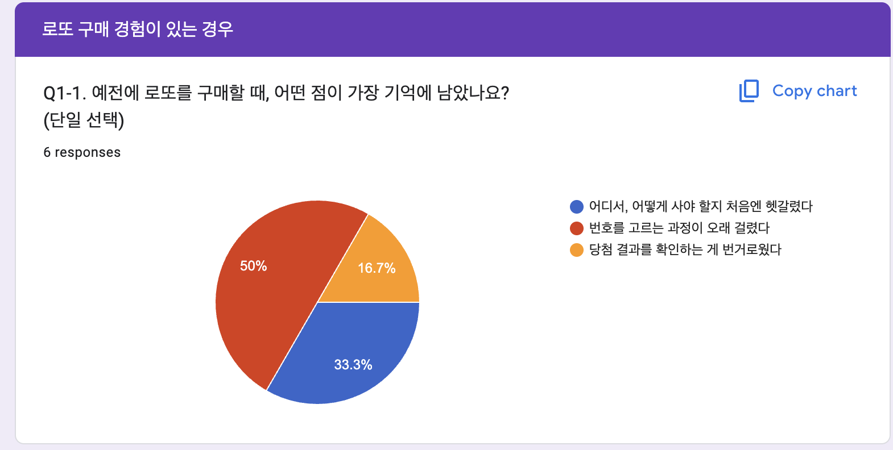
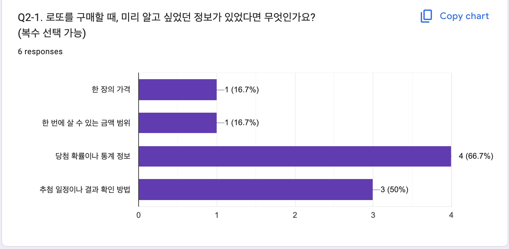
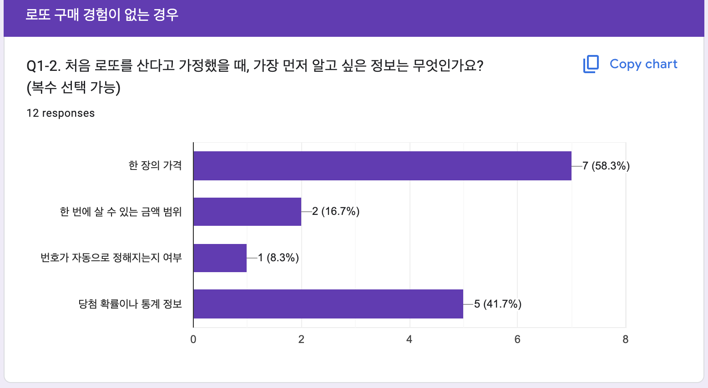
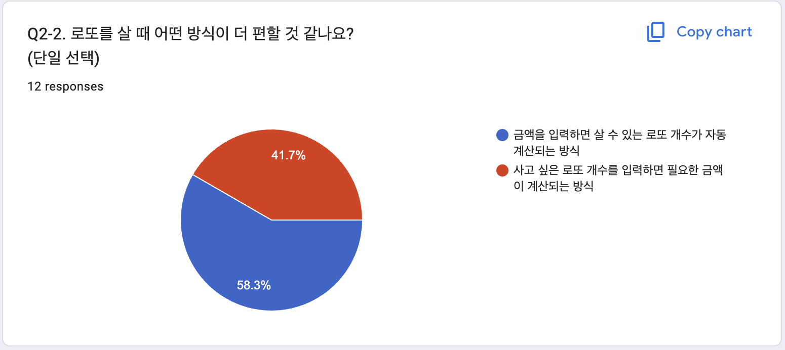
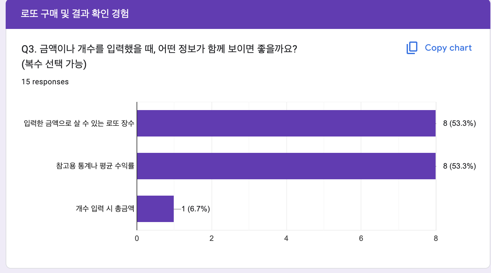
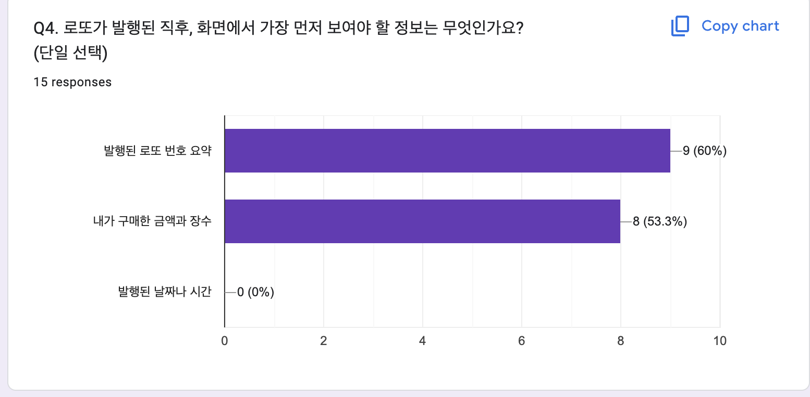
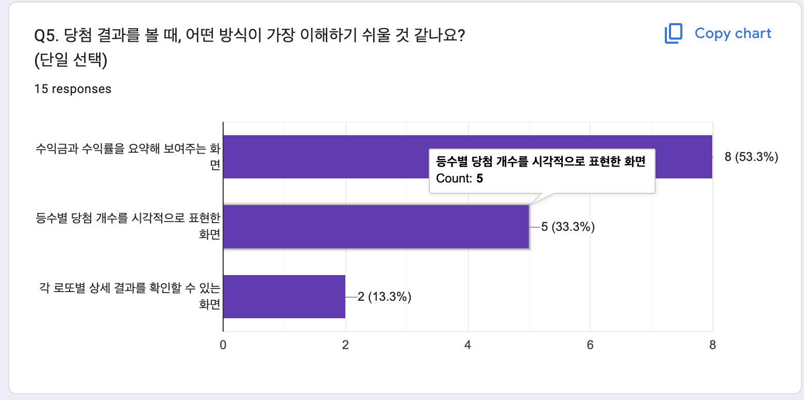
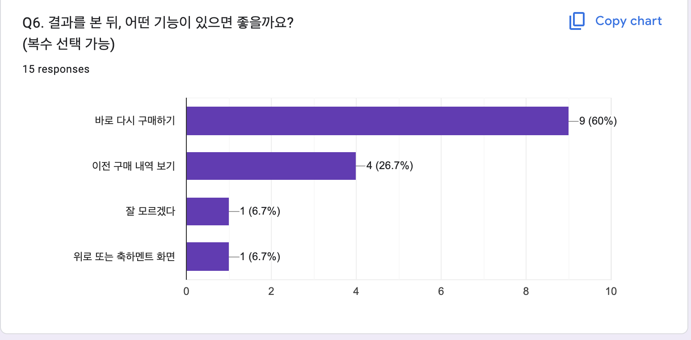
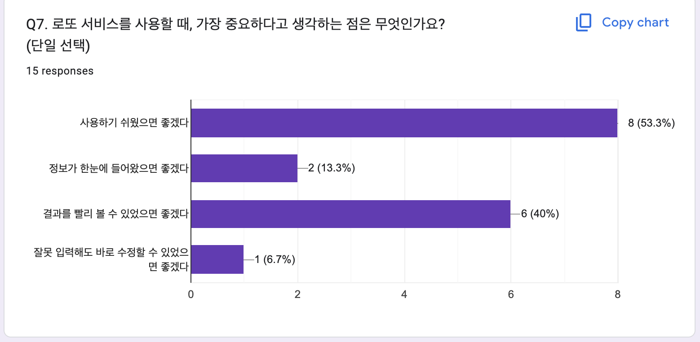

# 유저 리서치 & 분석

이 문서는 CLI 기반 로또 프로그램을 웹 서비스로 확장하기 위한 UX 설계 과정에서  
진행한 유저 리서치 및 분석 내용을 정리한 것입니다.

본 분석은 실제 사용자들의 관점·목표·문제·선호도를 파악하여  
웹 서비스의 정보 구조(IA), 화면 구성(UI), 사용자 흐름(Flow)을 설계하기 위한 기반 자료입니다.

## 사용자 관점 이해

### 1. 사용자 상황 가정

- 사용자는 로또 프로그램을 처음 접하는 사람이다.
- 복잡한 입력 과정보다 **“로또를 어떻게 사고, 결과를 어떻게 확인하는지”**라는 전체 흐름을 빠르게 이해하길 원한다.
- 목표는 단순한 구매가 아니라, **손쉽게 참여하고 즉시 결과를 확인하는 경험**이다.
- 사용자는 웹 환경에서 시각적인 안내를 기대하며, 잘못된 입력에 대한 즉각적인 피드백을 원한다.


### 2. 사용자가 알고 싶어 하는 핵심 정보

#### 2-1. 로또 구매의 기본 규칙  
*(이 서비스는 어떤 방식으로 로또를 사는 걸까?)*

- 사용자는 로또 한 장의 가격과 구매 단위를 알고 싶어한다.
- 입력한 금액이 몇 장의 로또로 환산되는지, 그리고 구매 가능한 최소·최대 금액이 무엇인지 궁금해한다.
- 금액이 로또 발행 수와 어떻게 연결되는지 명확히 이해하고 싶어한다.

#### 2-2. 번호 생성 방식  
*(내가 금액을 입력하면 어떤 일이 일어나는 걸까?)*

- 사용자는 금액을 입력했을 때 시스템이 어떤 방식으로 로또를 발행하는지 알고 싶어한다.
- 시스템이 로또 번호를 자동으로 생성한다는 점, 각 로또가 서로 다른 조합을 가진다는 점에 관심을 가진다.

#### 2-3. 입력 규칙 및 제약 조건  
*(입력할 때 주의해야 하는 규칙이 있을까?)*

- 사용자는 입력 과정에서 어떤 값이 유효한지, 어떤 입력이 오류로 처리되는지를 알고 싶어한다.
- 금액 단위나 입력 형식의 제약, 유효하지 않은 입력에 대한 피드백 방식을 알고 싶어한다.

#### 2-4. 서비스 이용 흐름  
*(로또가 발행된 다음에는 어떤 과정을 거치게 될까?)*

- 사용자는 금액 입력 이후 어떤 단계가 이어지는지 알고 싶어한다.
- 구매 후 당첨 번호를 입력하고 결과를 확인하기까지의 전체 과정이 한눈에 이해되길 원한다.

#### 2-5. 결과 제공 방식  
*(결과는 어떤 형태로 제공될까?)*

- 사용자는 결과 화면에서 어떤 정보를 볼 수 있을지 알고 싶어한다.
- 자신의 로또별 당첨 여부, 등수별 통계, 총 수익률 등 핵심 정보가 어떻게 요약되는지 궁금해한다.

#### 2-6. 오류 및 피드백 방식  
*(잘못되거나 오류가 발생하면 어떻게 대응할 수 있을까?)*

- 사용자는 입력 오류나 시스템 문제 발생 시 어떤 피드백을 받는지 알고 싶어한다.
- 오류의 원인이 명확히 안내되고, 수정 방법이 분명하게 제시되길 기대한다.


## 사용자 목표 정의

사용자는 복잡한 과정이나 추가 입력 없이 금액만 입력해 로또를 간편하게 구매하고, 즉시 결과와 수익률을 확인함으로써 빠르고 명확한 구매 경험을 얻고자 할 것이다.


## 기존 서비스 분석

| 구분 | 1단계: 로또 프로그램을 실행한다 | 2단계: 구매 금액을 입력한다 | 3단계: 구매 가능한 로또 장수를 확인한다 |
| --- | --- | --- | --- |
| **서비스 상태** | 프로그램 실행 직후 콘솔 입력이 바로 시작된다. 사용 방법이나 기능 안내는 제공되지 않는다. | ‘구입 금액을 입력하라’는 메시지가 표시되고, 사용자는 숫자만 입력할 수 있다. 잘못된 값을 입력하면 에러 메시지가 출력된 뒤 프로그램이 종료된다. | 금액 입력이 완료되면 프로그램이 자동으로 구매 가능한 로또 장수를 계산해 출력한다. |
| **사용자 감정 상태** | 불편 - 사용자는 어떤 기능이 있는지 명확히 알지 못해 혼란스러움을 느낄 것이다. | 불편 - 입력 규칙(단위 등)을 몰라 오류가 발생하면 당황스러움을 느낄 것이며, 프로그램이 종료되어 불편함을 느낄 것이다. | 불편 - 구매 전 입력한 금액으로 몇 장을 살 수 있는지 알 수 없어 답답함을 느낄 것이다. |
| **개선 방향** | 초기 화면에서 ‘금액 입력 → 로또 발행 → 당첨 확인 → 결과 조회’의 전체 흐름을 간략히 안내한다. | 입력란에 단위를 명시하고, 잘못된 입력 시 즉시 오류 메시지를 제공해 수정할 수 있도록 한다. | 금액 입력 시 실시간으로 구매 가능한 로또 장수를 표시한다. |

| 구분 | 4단계: 로또를 발행한다 | 5단계: 당첨 번호를 입력하고 결과를 확인한다 | 6단계: 결과를 보고 다시 구매하거나 종료한다 |
| --- | --- | --- | --- |
| **서비스 상태** | 금액 입력 직후 로또가 자동 발행되며, 각 로또 번호가 한 줄씩 출력된다. | 당첨 번호와 보너스 번호를 입력하면 결과가 텍스트 형태로 출력된다. | 결과를 출력한 후 프로그램이 자동 종료된다. |
| **사용자 감정 상태** | 보통 - 사용자는 로또가 자동으로 발행되어 통제감이 부족하다고 느낄 것이다. | 불편 - 수익률과 당첨 내역이 텍스트로만 표시되어 결과를 직관적으로 이해하기 어렵다고 느낄 것이다. | 불편 - 프로그램이 종료되어, 다시 실행해야 하는 번거로움을 느낄 것이다. |
| **개선 방향** | ‘구매하기’ 버튼을 통해 사용자가 직접 발행 시점을 결정하도록 한다. | 수익률과 총 수익을 상단에 시각적으로 표시하고, 등수별 결과를 표 형태로 제공한다. | 결과 화면에 ‘다시 구매하기’ 버튼을 추가해 프로그램을 재실행하지 않고도 이어서 구매할 수 있도록 한다. |


## 설문 설계 및 분석

### 설문 설계

```
설문 목적:  
안녕하세요! 이번 조사는 ‘로또를 구매하고 결과를 확인하는 과정’에서  
사용자가 어떤 정보와 경험을 중요하게 생각하는지를 알아보기 위한 설문입니다.  
가볍게 참여해주시면 감사하겠습니다 :)  
소요 시간은 약 3~5분입니다.

프로그램 간단 소개:  
이 서비스는 사용자가 금액을 입력하면,  
입력한 금액만큼 로또가 자동으로 발행됩니다.  
그 후 사용자가 입력한 당첨 번호와 비교해 결과를 보여줍니다.  
즉, 번호는 직접 고르지 않고  
‘금액 입력 → 자동 발행 → 결과 확인’ 순서로 진행됩니다.

---

Q0. 로또를 구매해본 적이 있으신가요?  
(실제 복권이든, 비슷한 프로그램이든 모두 포함됩니다.)  
- 있다  
- 없다

---

[Q0 = "있다" 선택 시 표시]

Q1-1. 예전에 로또를 구매할 때, 어떤 점이 가장 기억에 남았나요?  
- 어디서, 어떻게 사야 할지 처음엔 헷갈렸다  
- 번호를 고르는 과정이 오래 걸렸다  
- 당첨 결과를 확인하는 게 번거로웠다  
- 기타 (직접 작성)

Q2-1. 로또를 구매할 때, 미리 알고 싶었던 정보가 있었다면 무엇인가요? (복수 선택 가능)  
- 한 장의 가격  
- 한 번에 살 수 있는 금액 범위  
- 당첨 확률이나 통계 정보  
- 추첨 일정이나 결과 확인 방법  
- 기타 (직접 작성)

---

[Q0 = "없다" 선택 시 표시]

Q1-2. 처음 로또를 산다고 가정했을 때, 가장 먼저 알고 싶은 정보는 무엇인가요? (복수 선택 가능)  
- 한 장의 가격  
- 한 번에 살 수 있는 금액 범위  
- 번호가 자동으로 정해지는지 여부  
- 당첨 확률이나 통계 정보  
- 기타 (직접 작성)

Q2-2. 로또를 살 때 어떤 방식이 더 편할 것 같나요?  
- 금액을 입력하면 살 수 있는 로또 개수가 자동 계산되는 방식  
- 사고 싶은 로또 개수를 입력하면 필요한 금액이 계산되는 방식  
- 기타 (직접 작성)

---

[공통 문항]

Q3. 금액이나 개수를 입력했을 때, 어떤 정보가 함께 보이면 좋을까요? (복수 선택 가능)  
- 입력한 금액으로 살 수 있는 로또 장수  
- 참고용 통계나 평균 수익률  
- 기타 (직접 작성)

Q4. 로또가 발행된 직후, 화면에서 가장 먼저 보여야 할 정보는 무엇인가요?  
- 발행된 로또 번호 요약  
- 내가 구매한 금액과 장수  
- 발행된 날짜나 시간  
- 기타 (직접 작성)

Q5. 당첨 결과를 볼 때, 어떤 방식이 가장 이해하기 쉬울 것 같나요?  
- 수익금과 수익률을 요약해 보여주는 화면  
- 등수별 당첨 개수를 시각적으로 표현한 화면  
- 각 로또별 상세 결과를 확인할 수 있는 화면  
- 기타 (직접 작성)

Q6. 결과를 본 뒤, 어떤 기능이 있으면 좋을까요? (복수 선택 가능)  
- 바로 다시 구매하기  
- 이전 구매 내역 보기  
- 기타 (직접 작성)

Q7. 로또 서비스를 사용할 때, 가장 중요하다고 생각하는 점은 무엇인가요?  
- 사용하기 쉬웠으면 좋겠다  
- 정보가 한눈에 들어왔으면 좋겠다  
- 결과를 빨리 볼 수 있었으면 좋겠다  
- 잘못 입력해도 바로 수정할 수 있었으면 좋겠다  
- 기타 (직접 작성)

```

### 설문 결과 분석


→ 응답자의 60%가 로또 구매 경험이 없어, **초보 사용자 중심의 안내 설계**가 필요하다.



→ 응답자의 절반(50%)이 **번호를 고르는 데 시간이 오래 걸렸다**고 답했고, 33.3%는 **구매 절차가 헷갈렸다**고 응답했다.  
이는 사용자가 **번호 선택 과정에서 어려움을 느끼고**, **구매 흐름을 직관적으로 이해하기 어려웠음**을 보여준다.



→ 응답자 대부분이 **당첨 확률(66.7%)**과 **결과 확인 방법(50%)**을 중요하게 여겨, 로또를 실제로 구매한 사람들은 **구매 과정 자체보다 ‘당첨 가능성과 결과’에 대한 정보**를 더 중요하게 여기는 경향을 보였다.



→ ‘한 장의 가격(58.3%)’과 ‘당첨 확률(41.7%)’이 주로 선택되었다.  
이는 **로또를 처음 구매하는 사람들에게는 구매 관련 기본 정보가 우선적으로 필요하고**, 그다음으로 **당첨 가능성에 대한 정보에 관심을 가진다**는 점을 보여준다.



→ ‘금액을 입력하면 개수가 자동 계산되는 방식(58.3%)’이 선호되어, **금액 중심의 입력 구조**가 적합하다.



→ ‘구매 가능한 로또 장수(53.3%)’와 ‘평균 수익률(53.3%)’이 동일하게 선택되었다.  
이는 사용자가 금액 입력 단계에서 **입력한 금액으로 살 수 있는 로또의 장수 + 당첨 관련 정보(예: 기대 수익률)** 모두 확인하길 원한다는 것을 의미한다.



→ ‘발행된 로또 번호 요약(60%)’과 ‘구매 금액과 장수(53.3%)’가 가장 많이 선택되었다.  
응답자들은 **로또 발행 직후 자신이 어떤 번호의 로또를 몇 장 발행했는지** 가장 먼저 확인하길 원했다.



→ ‘수익금과 수익률 요약(53.3%)’과 ‘등수별 당첨 개수 시각화(33.3%)’가 주요 선택지였다.  
이는 사용자가 **세부 정보보다 전체 결과를 한눈에 파악할 수 있는 요약형·시각적 결과 화면**을 선호함을 보여준다.



→ ‘다시 구매하기(60%)’가 가장 높게 나타나, **즉시 재구매로 이어지는 자연스러운 흐름 설계**가 필요하다.



→ ‘사용하기 쉬웠으면 좋겠다(53.3%)’와 ‘결과를 빨리 볼 수 있었으면 좋겠다(40%)’가 주요 응답이었다.  
이는 사용자가 **복잡한 기능보다 직관적 조작과 빠른 결과 확인이 가능한 서비스 경험**을 가장 중요하게 생각함을 보여준다.


### 인사이트 도출

1. **초보자 중심의 단계별 안내와 정보 우선순위 설계 필요**  
   응답자의 60%가 로또 구매 경험이 없어, 화면에서는 **구매 관련 핵심 정보 → 당첨 정보**의 순서로 제공하는 단계별 구조가 적합하다.

2. **금액 중심 입력 + 즉각 피드백 구조 필요**  
   사용자는 금액을 기준으로 로또를 구매하길 원하며, **입력 즉시 구매 가능한 장수와 기대 수익률을 보여주는 피드백**을 선호한다.

3. **요약형·시각적 결과 화면 필요**  
   사용자는 복잡한 텍스트보다 **번호·금액·수익률 등 핵심 정보를 빠르게 파악할 수 있는 요약 중심 화면**을 원한다.

4. **끊김 없는 재구매 흐름 설계 필요**  
   ‘다시 구매하기’ 선호도가 가장 높아, **결과 확인 → 즉시 재구매** 로 이어지는 UI 흐름이 필요하다.
