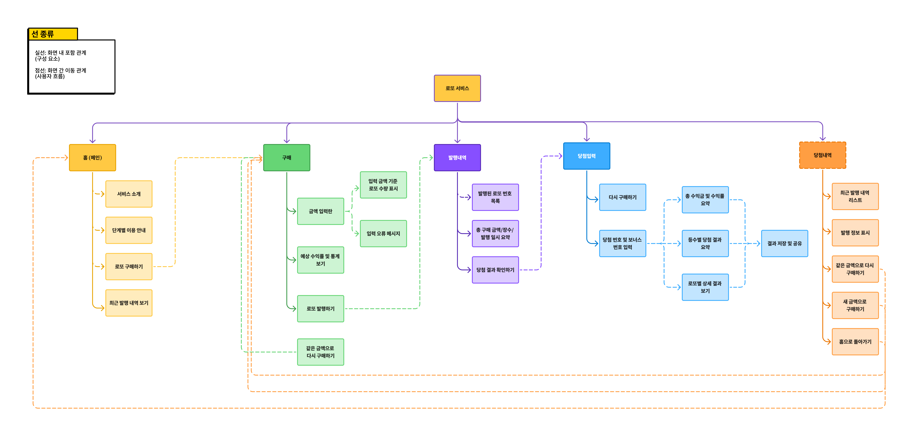

# 정보 구조(IA) 설계

이 문서는 로또 웹 서비스의 전체 화면 구조와 기능 흐름을 정의하기 위해 작성된 IA(Information Architecture) 설계 문서입니다.  
앞선 사용자 리서치 및 분석 결과를 기반으로, 서비스 이용 과정 전반을 단계별로 구조화하고  
각 화면에서 제공해야 하는 핵심 정보와 기능의 배치를 체계적으로 정리하는 것을 목표로 합니다.

본 문서는 UI 설계, 서비스 제작의 기준이 되는 상위 구조로서  
서비스 경험(UX)의 일관성과 사용성 향상을 위한 기초 자료로 활용됩니다.


## Figma 디자인 문서 링크
- 전체 IA & 화면 흐름: https://www.figma.com/design/43vQifqMFKYPgC0JwZTb2u/%EB%A1%9C%EB%98%90-%EC%84%9C%EB%B9%84%EC%8A%A4?node-id=0-1&t=lVSlN1jRHcGSbPUC-1

  (서비스 전체 구조, 화면 단위 흐름, UX 플로우를 포함한 Figma 문서입니다.)


## IA 1차 분류 (화면 별 기능 나열)
아래 구조는 서비스 사용 과정에서 각 화면이 수행해야 하는 핵심 기능을 1차적으로 분류한 것입니다.

```plain
1. 홈 화면
- 서비스 소개
- 단계별 이용 안내(금액 입력 → 로또 발행 → 결과 확인)
- 로또 구매하기
- 최근 발행 내역 보기

2. 로또 구매 화면
- 금액 입력란
- 입력한 금액으로 구매 가능한 로또 수량 표시
- 입력 오류 메시지 표시
- 예상 수익률 및 통계 정보 보기
- 로또 발행하기
- 같은 금액으로 다시 구매하기

3. 로또 발행 결과 화면
- 발행된 로또 번호 목록
- 총 구매 금액, 장수, 발행 일시 요약
- 당첨 결과 확인하기

4. 당첨 결과 화면  
- 당첨 번호 및 보너스 번호 입력란  
- 총 수익금과 수익률 요약  
- 등수별 당첨 결과 요약  
- 로또별 상세 결과 확인  
- 다시 구매하기  
- 결과 저장 및 공유  

5. 결과 이후 화면  
- 최근 발행 내역 리스트  
- 각 발행의 금액, 장수, 수익률, 일시 표시  
- 홈으로 돌아가기
```

## IA 다이어그램


*서비스 전체 흐름을 트리 구조로 표현한 IA 다이어그램*

