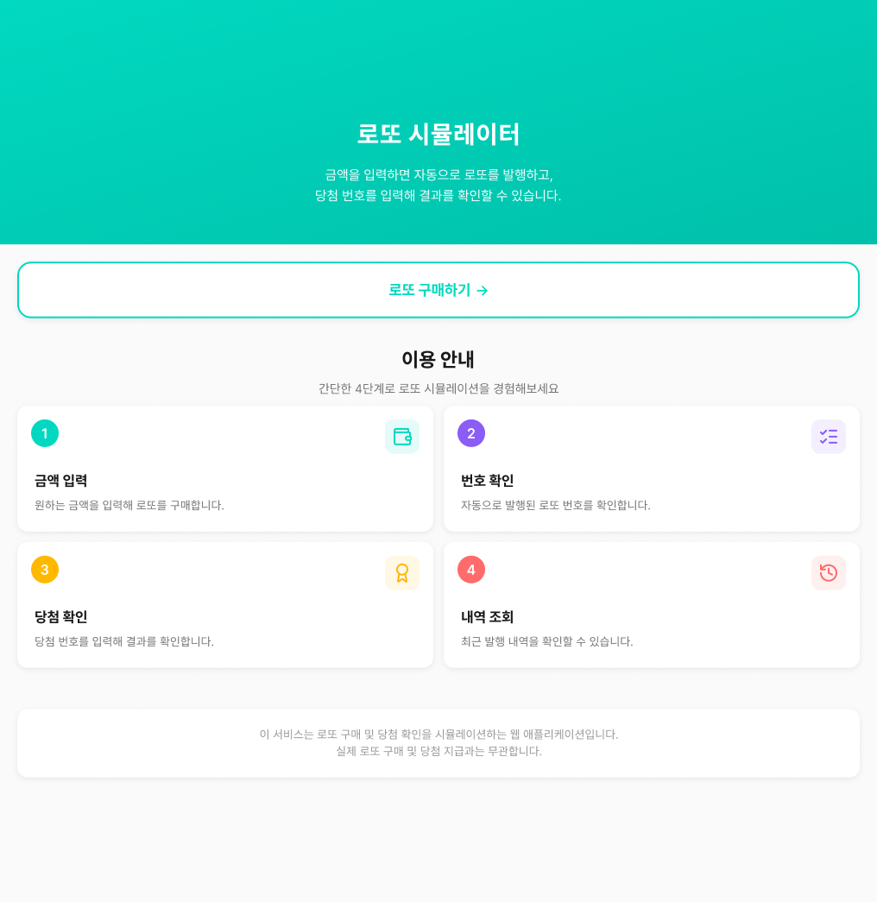

# UI Design

이 문서는 로또 웹 서비스의 실제 화면(UI)을 정리한 문서입니다.  
Figma에서 설계된 화면들을 기반으로 각 페이지의 기능, 시각적 흐름, 의도 등을 설명합니다.

## Figma 링크
- 전체 디자인 파일: https://www.figma.com/design/43vQifqMFKYPgC0JwZTb2u/%EB%A1%9C%EB%98%90-%EC%84%9C%EB%B9%84%EC%8A%A4?node-id=8-5127&t=lVSlN1jRHcGSbPUC-1

## 0. 홈 화면 (Home)

### 의도
- 서비스 목적을 직관적으로 전달
- 로또 구매 흐름(금액 입력 → 발행 → 결과) 사전 안내
- 구매/당첨내역/통계로 자연스럽게 이동

# 1. 로또 구매 화면

## 1-1. 기본 화면

### 의도
- 사용자가 금액만 입력하면 로또가 자동 발행되는 서비스 구조를 분명하게 전달
- 1,000원 단위 입력 가이드 제공
- 예상 발행 장수를 실시간 계산하여 즉각적인 피드백 제공

## 1-2. 입력 오류 화면

### 의도
- 잘못된 입력(예: 1,000원 단위 아님)을 즉시 시각적으로 안내
- 프로그램 종료가 아니라 **사용자가 스스로 수정할 수 있는 구조** 제공

## 1-3. 정상 입력 → 발행 가능 상태

### 의도
- 유효한 금액 입력 시 버튼 활성화
- “몇 장 구매하기” 버튼을 통해 명확한 액션 제공

# 2. 구매 완료 화면 

### 의도
- 발행 장수, 구매 금액, 발행 일시 등을 한눈에 정리
- “당첨 확인하기”로 자연스럽게 흐름 이어가기
- “홈으로 돌아가기”를 통해 전체 플로우 재실행도 가능

# 3. 당첨 번호 입력 화면 (Winning Input)

## 3-1. 기본 입력 화면

### 의도
- 입력 제약을 시각적으로 표현
- 숫자 입력 시 자동으로 다음 칸으로 이동하여 UX 개선
- 보너스 번호를 분리하여 구조 명확화

## 3-2. 입력 오류 상태

### 의도
- 중복 번호, 범위 오류 등 사용자가 실수하기 쉬운 부분 즉시 피드백
- 붉은색 경고 영역을 명확하게 제공

# 4. 당첨 결과 화면 (Result Summary)

## 4-1. 기본 요약 결과

### 의도
- 구매 금액, 총 당첨 금액, 수익률 등 핵심 지표를 최상단에서 요약
- 등수별 당첨 횟수를 시각적으로 배치하여 빠르게 파악 가능
- “다시 구매하기”, “내역 확인” 등 후속 행동을 자연스럽게 유도

## 4-2. 상세 결과 화면

### 의도
- 각 로또 번호 조합의 일치 여부를 컬러 기반으로 시각화
- A~J와 같은 라벨을 사용해 사용자가 여러 장을 쉽게 구분
- 스크롤 기반으로 많은 로또 장수도 자연스럽게 탐색 가능

# 5. 구매 내역 화면

## 5-1. 기본 내역 목록

### 의도
- 사용자가 지금까지 구매한 모든 로또 기록을 한눈에 확인
- 금액과 장수 요약 제공으로 전체 흐름 파악 용이

## 5-2. 내역 상세 확장

### 의도
- 각 게임 번호를 상세히 펼쳐서 발행된 번호 리스트 확인
- “당첨 확인하기”를 통해 바로 결과 확인으로 이동 가능
